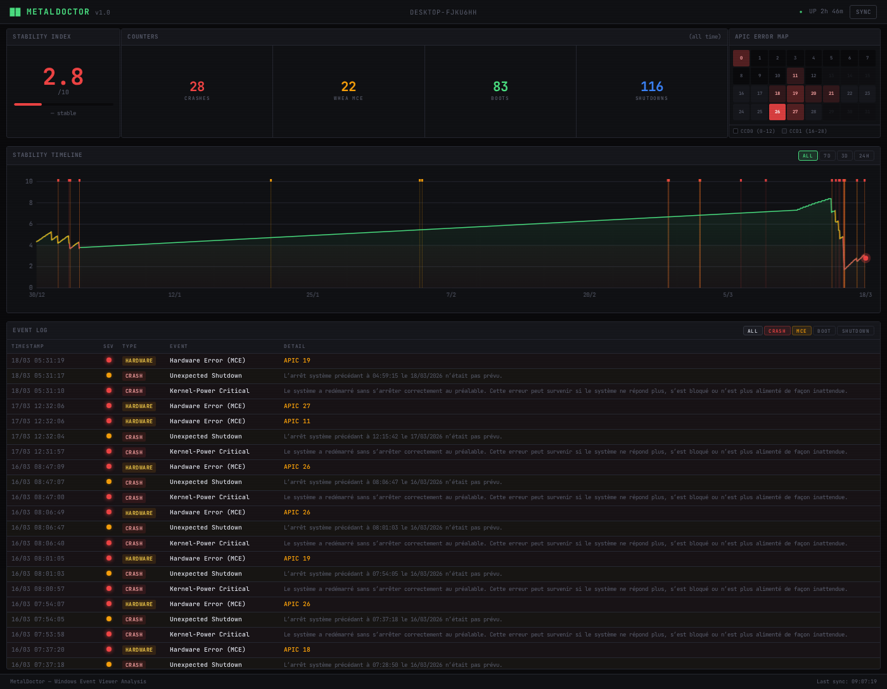

# MetalDoctor

Hardware health monitor that reads Windows Event Viewer data and displays it as a diagnostic dashboard.

 



## What it does

Pulls system events via PowerShell and presents them in a dense, technical UI:

- **Stability Index** — Windows Reliability Monitor score (1-10) tracked over time
- **WHEA MCE Errors** — Machine Check Exceptions with APIC ID heatmap (auto-detects CPU topology)
- **Crash Timeline** — Kernel-Power critical events, unexpected shutdowns, BSODs
- **Boot/Shutdown Log** — Full system lifecycle with expandable details
- **Chart Crosshair** — Hover the stability chart to highlight corresponding events in the log

## Requirements

- [Bun](https://bun.sh) runtime
- Windows (or WSL with access to `powershell.exe`)

## Setup

```bash
bun install
bun start
```

Open **http://localhost:3000**

## Data

Events are fetched from Windows Event Viewer via PowerShell and cached in a local SQLite database (`metaldoctor.db`). Click **SYNC** to force a fresh pull.

Monitored event sources:

| Source | Event IDs | What |
|--------|-----------|------|
| Kernel-Power | 41 | Critical power failure |
| EventLog | 6008 | Unexpected shutdown |
| EventLog | 6005, 6006 | Boot / clean shutdown |
| User32 | 1074 | User-initiated shutdown/restart |
| BugCheck | 1001 | BSOD |
| WHEA-Logger | * | Hardware MCE errors |
| Reliability Metrics | * | Stability index history |

## API

| Endpoint | Description |
|----------|-------------|
| `GET /api/timeline` | All events sorted by timestamp (newest first) |
| `GET /api/history` | Stability index + events combined |
| `?refresh=1` | Force re-fetch from Windows Event Viewer |

## License

MIT
